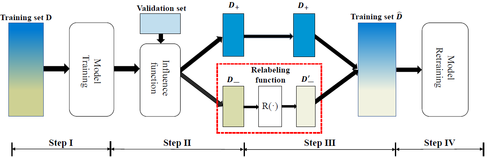
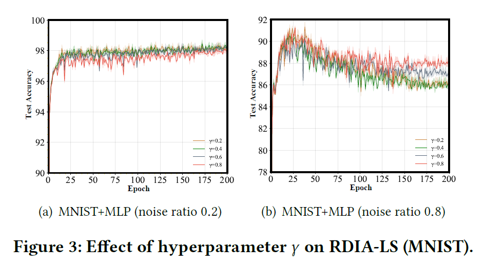

## Resolving Training Biases via Influence-based Data Relabeling

This repository is the official implementation of our ICLR2022 paper: "[Resolving Training Biases via Influence-based Data Relabeling](https://openreview.net/forum?id=EskfH0bwNVn)"

#### Paper Citation

```
@inproceedings{
kong2022resolving,
title={Resolving Training Biases via Influence-based Data Relabeling},
author={Shuming Kong and Yanyan Shen and Linpeng Huang},
booktitle={International Conference on Learning Representations},
year={2022},
url={https://openreview.net/forum?id=EskfH0bwNVn}
}

```

#### Brief Introduction

RDIA aims to reuse harmful training samples toward better model performance. To achieve
this, we use influence functions to estimate how relabeling a training sample would
affect model’s test performance and further develop a novel relabeling function R to update the labels of identified harmful samples.  Our framework can be shown as the image below:



#### Requirements

To install requirements:

* Python 3.7

```
pip install -r requirement.txt
```

#### Training & Evaluation

##### Experiments of RDIA

To train the model,  run this command:

```
python RDIA.py --dataset realsim  --noise 0.8 --alpha 0.0002
python RDIA.py --dataset mnist    --noise 0.8 --alpha 0.0002
python RDIA.py --dataset cancer   --noise 0.8 --alpha 0.0002
```

The hyperparameter \alpha should be tuned with dataset and noise rate.  For example, the experiments over **MNIST** are shown below:

|      RDIA       | Noise=0.0 | Noise=0.2 | Noise=0.5 | Noise=0.8 |
| :-------------: | :-------: | :-------: | :-------: | :-------: |
|  \alpha = 0.01  |  0.0235   |  0.0443   |  0.0903   |  0.1009   |
| \alpha = 0.002  |  0.0207   |  0.0315   |  0.0519   |  0.0465   |
| \alpha = 0.0002 |  0.0903   |  0.0392   |  0.0410   |  0.0405   |

Due to the limitation of Supplementary material, we only uploaded three datasets. All the datasets could be found in [here](https://www.csie.ntu.edu.tw/~cjlin/libsvmtools/datasets/).

##### Experiments of RDIA-LS

To train the model, run this command:

```
python RDIA-LS.py --result_dir <path to your dir>  --dataset cifar10 --noise_rate 0.8 --weight_decay 0      --gamma 0.05 --gpu 1

python RDIA-LS.py --result_dir <path to your dir>  --dataset mnist   --noise_rate 0.8 --weight_decay 0.00001 --gamma 0.2  --gpu 1
```

The hyperparameter \gamma should be tuned with dataset and noise rate. Average test accuracy on MNIST and CIFAR10 with 80% noise rata is :

|  Model  |    MNIST     |   CIFAR10    |
| :-----: | :----------: | :----------: |
| RDIA-LS | 87.85 ± 0.21 | 25.35 ± 0.17 |

We also provide the test accuracy vs. number of epochs below:



## Results

All the experimental results could be reproduced by the aforementioned code.  We have already shown some of the experimental results in the 'Training & Evaluation' section.


## Acknowledgement

We would like to thank Zifeng Wang et al. for their fascinating work and public [code](https://github.com/RyanWangZf/Influence_Subsampling). 